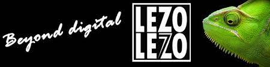






<link rel="stylesheet" href="/glyphicons/css/glyphicons.css" />

<table style="width:100%">
<col width="20%">
<col width="10">
<col >

<tr style="border-bottom:1pt solid #eee">
<td markdown="1">

</td>
<td></td>
<td markdown="1">
[**Fasiconnect Congo-Kinshasa**](http://fasiconnect.cd)

the Fasiconnect project aims to attract investors from the agricultural land sector in the Democratic Republic of Congo.
</td> 
</tr>

<tr style="border-bottom:1pt solid #eee">
<td markdown="1">

</td>
<td></td>
<td markdown="1">
[**Lezolezo**](https://lezolezo.com)

In this project, We solve problems through collaboration, creative strategy and technologies integration in the DRCongo.
</td> 
</tr>

<!-- 
<tr height="25"/>
<tr style="border-bottom:1pt solid #eee" >
<td markdown="1">
{:class="img-shadow"}
</td>
<td></td>
<td markdown="1">
**AR Camera: An Augmented Reality Prototype for Mobile Devices of Lenovo.**
- Prototyped an application with an AR effect for QR code or a dish of food, to improve user experience.
- Developed detection, tracking and stereo algorithms to obtain a real-time and smooth effect.

|| <em class="icon-film"/> || [video demo](https://youtu.be/XUTCowMHSQs) ||

</td> 
</tr> -->

<!-- </table> -->

